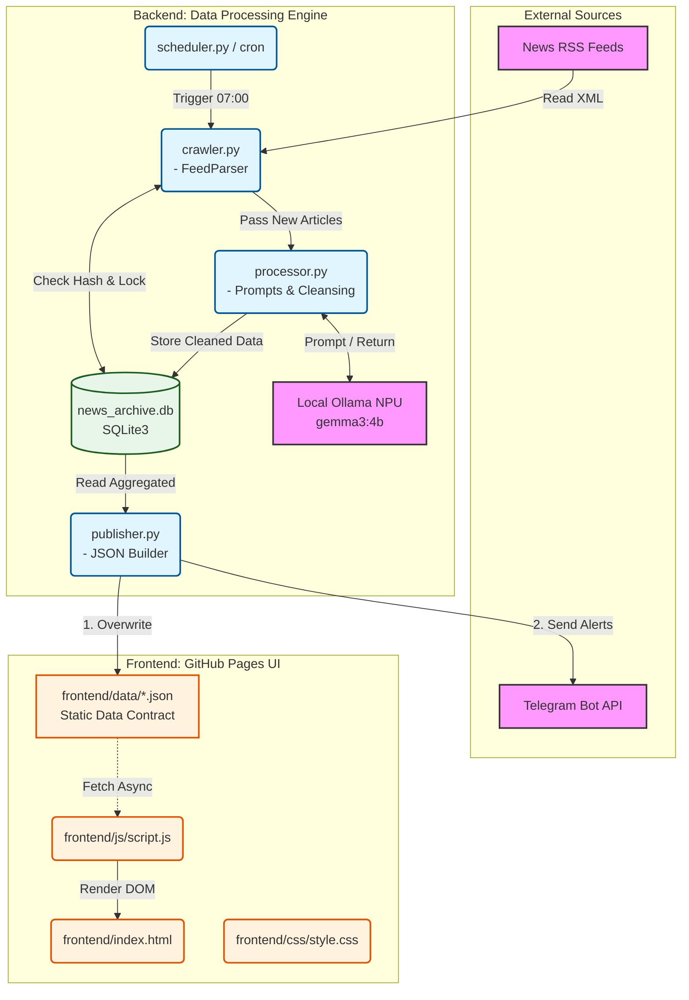

# 아키텍처 3단계: 시스템 컴포넌트 설계 및 통신 규약 (Architecture Design)

본 문서는 **[AI News Archive: 아키텍트의 8단계 실행 계획서]**의 3단계 산출물로, 시스템의 전체적인 뼈대(Architecture Style)부터 컴포넌트 분해, 기술 스택, 그리고 모듈 간 통신 규약(Data Contract)을 엄격하게 정의합니다. 개발팀(마이클, 리암, 데이비드, 에밀리)의 합의된 기술 표준안입니다.

---

## 1. 아키텍처 스타일 및 시스템 분해 (Architecture Style & Decomposition)

### 1-1. 아키텍처 스타일 선정: "Decoupled Monolithic Repository (분리형 모놀리스)"
본 시스템은 예산 0원 유지 및 인프라 운영 단순화를 위해 마이크로서비스(MSA)나 이벤트 기반(Event-Driven) 스타일을 극단적으로 배제합니다.
대신 프론트엔드와 백엔드가 하나의 깃허브 저장소(Monorepo) 안에 공존하되, 코드가 서로를 절대 직접 호출(API Call)하지 않고 생성된 **정적 파일(JSON)만을 매개로 결합이 끊어진(Decoupled) 형태의 모놀리스 구조**를 채택합니다.

### 1-2. 시스템 분해 및 컴포넌트 경계 (System Component Diagram)
시스템은 크게 세 가지 논리적 컴포넌트로 분해됩니다: **Data Sourcing (크롤링)**, **AI Brain (요약 및 태그)**, **Static View (프론트 렌더링)**.



---

## 2. 기술 스택 선정 (Technology Stack)

비용 제로 원칙과 로컬 M4 칩셋의 하드웨어 가속을 극대화하기 위해 다음과 같이 기술 스택을 확정합니다 (데이비드, 리암 동의).

| 구분 | 목적 | 선정 기술 | 선정 사유 (Rationale) |
|---|---|---|---|
| **Programming Language** | 백엔드 파이프라인 코어 로직 | **Python 3.10+** | HTTP(requests), RSS(feedparser), DB(sqlite3) 내장 지원이 가장 훌륭하며, AI 생태계 커뮤니티 성숙도가 가장 높음. |
| **Frontend Framework** | UI/UX 렌더링 | **Vanilla HTML / CSS / JS** | 리액트 등 무거운 프레임워크 불필요. 프론트엔드는 데이터 로딩(Fetch)과 DOM 조작만 하므로 가장 가볍고 브라우저 네이티브한 환경으로 구축하여 로딩 속도 극대화. |
| **Database** | 크롤링 원본 / 중복 관리 저장소 | **SQLite 3** | 파일 기반의 경량 RDBMS. 클라우드 DB 서버 통신 비용(Latency 및 Cost)이 전혀 발생하지 않음. ACID 보장으로 동시성 에러 방지. |
| **AI LLM Runtime** | 모델 실행 및 API 서빙 | **Ollama** | Apple Silicon(M4) 칩의 NPU(Neural Engine) 및 Unified Memory를 가장 효율적으로 끌어다 쓰는 C++ (`llama.cpp`) 기반 프레임워크. |
| **Hosting & CD** | 정적 파일 서빙 배포 | **GitHub Pages** | 저장소 Push만으로 월 100GB 대역폭까지 무료 서빙. 백엔드(Python)에서 찍어낸 JSON을 가장 안전하게 배포할 수 있는 CD 인프라. |

---

## 3. 인터페이스 및 API 설계 원칙 (Interface Principles)

이 시스템에는 동적 서버(Dynamic Server)가 없으므로 전통적인 RESTful API나 GraphQL을 설계하지 않습니다. 
대신 **"File-as-a-Database (JSON Contract)"** 원칙을 수립합니다.

1.  **단뱡항 데이터 흐름 (One-way Data Flow):** 프론트엔드(리암) 로직은 백엔드 로직에 그 어떤 Request(Post, Put 등)도 보낼 수 없습니다. 오직 백엔드(데이비드)가 찍어낸 결과물(JSON)을 `GET` 방식으로 읽기만 합니다(Read-only).
2.  **모듈-애그노스틱 (Model-Agnostic)과 유저 친화성:** 백엔드 통신 인터페이스는 `config.yml` 설정에 지정된 모델명 파라미터(`llm_model`)에만 의존해야 합니다. 코니(비개발자)가 에디터로 이 텍스트 파일의 글자만 `gemma3:4b`에서 `Llama3.2`로 고치면, 파이썬 코드 수정 없이 즉시 AI 두뇌가 교체되도록 시스템을 추상화(Abstraction)합니다. 스케줄링 시간 역시 이 `config.yml`을 통해 UI/UX 없이 제어합니다.
3.  **JSON Schema 강제 원칙:** 프론트엔드 뷰에 장애를 주지 않기 위해, 아래 명시된 JSON 포맷(Data Contract)은 절대로 변경되거나 필드가 누락되지 않음을 보장해야 합니다.

---

## 4. 디렉토리 구조 (Directory Boundary)

전체 시스템은 모놀리식 구조이되 뚜렷한 폴더 레벨 모듈 경계를 가집니다.

```text
M-O-3-S.github.io/ (프로젝트 루트)
│
├── frontend/             <- [리암 관할] 프론트엔드 정적 파일
│   ├── index.html                  (프론트엔드 정적 진입점)
│   ├── css/
│   │   └── style.css               (디자인 토큰 및 UI 컴포넌트)
│   ├── js/
│   │   └── script.js               (데이터 파싱 및 렌더링 로직)
│   └── data/                       (백엔드가 생성한 정적 JSON 보관)
│       ├── index.json
│       ├── daily/
│       ├── weekly/
│       └── news_archive.db         <- [개발 전용] SQLite 원본
│
├── backend/              <- [데이비드/마이클 관할] 백엔드 엔진
│   ├── src/                        (파이썬 스크립트 소스)
│   │   ├── main.py
│   │   └── ...
│   └── config/
│       ├── config.yml              (운영 설정)
│       └── .env                    (보안 키)
│
├── docs/                 <- [사라/전체 관할] 기획 및 설계 문서
│   ├── PRD/
│   ├── SWDesign/
│   └── UX/
│
├── tests/                <- [QA] 테스트 스크립트 및 TC
│
└── deploy.sh             <- [DevOps] 통합 배포 스크립트
```

> **[아키텍트의 Note: Repository 운영 전략]**
> 본 프로젝트는 프론트엔드(`frontend/`)와 백엔드(`backend/`)가 동일한 저장소 안에 도메인별로 격리된 **단일 저장소(Monorepo)** 로 운영됩니다. 
> 백엔드가 로컬에서 `frontend/data/` 경로에 JSON을 생성하고 나면, 전체 레포지토리가 커밋되어 GitHub Pages로 배포됩니다. 이는 LLM이 각 도메인별 코드 컨텍스트를 효율적으로 읽을 수 있도록 돕는 최적화된 구조입니다.

백엔드 파이썬 스크립트(publisher)는 프론트엔드 웹페이지가 읽을 수 있는 **정적 JSON 파일 포맷(Data Contract)**을 아래 스키마에 맞춰 `frontend/data/` 폴더에 생성해야 합니다.
리암(FE)은 오직 아래 명세(Schema)만을 신뢰하고 자바스크립트를 작성합니다.

### 4-1. `frontend/data/index.json` (메인 진입점 판단)
프론트엔드가 접속 시 제일 먼저 다운받아, "오늘/최근 날짜가 며칠인지", "총 며칠 치 아카이브가 있는지"를 판단하는 아주 작은 메타 파일.

```json
{
  "latest_daily_date": "2026-03-08",
  "latest_weekly_id": "2026_Week_10",
  "available_daily_archives": [
    "2026-03-08", "2026-03-07", "2026-03-06"
  ]
}
```

> **[파일 보존(Retention) 정책: 평생 소장]**
> 사라님(PM) 및 핵심 사용자(제니/코니)의 강력한 요구사항에 따라, 생성된 **`daily/*.json` 및 `weekly/*.json` 파일들은 1년이 지나도 절대 삭제되지 않고 영구 보존**됩니다.
> *   **기술 검토 결과:** GitHub Pages의 레포지토리 권장 용량은 1GB입니다. 시스템이 매일 생성하는 데일리 JSON 파일(약 50KB)을 1년 내내 모아도 고작 **18MB**에 불과합니다. 즉, **10년을 운영해도 180MB**밖에 되지 않으므로 파일 개수 증가로 인한 깃허브 정책 위반이나 트래픽 오버플로우 문제는 구조적으로 발생하지 않습니다.
> *   (단, 프론트엔드 최적화를 위해 메타 파일인 `index.json` 속 `available_daily_archives` 배열에는 브라우저 렌더링 부하를 막기 위해 최근 3개월 치 날짜만 기록하고, 그 이전 과거 날짜는 사용자가 캘린더를 넘길 때 동적으로(Lazy) 해당 월의 데이터 존재 여부를 체크하도록 프론트엔드를 구성합니다.)

### 4-2. `frontend/data/daily/YYYY-MM-DD.json` (데일리 주요 배열)
특정 날짜를 클릭했을 때 가져오는 통 데이터 세트. 각 기사 객체(Object)의 규격.

```json
{
  "date": "2026-03-08",
  "articles": [
    {
      "id": "fe83d1c...",            // 해시 ID
      "category": "거대 언어 모델 (LLM)",   // feeds.yaml에 지정된 카테고리
      "title": "[AI 속보] OpenAI 새로운 모델 공개", // 정규화된 원문 제목
      "summary": "새로운 멀티모달 프레임워크가 탑재된 이 모델은...", // 한국어 300자 요약
      "tags": ["LLM", "OpenAI", "멀티모달"], // 규칙 준수 배열형 태그 (최대 3개)
      "url": "https://news.url...",
      "published_at": "2026-03-08T07:05:01Z"
    }
  ]
}
```

## 5. Fallback 및 안전망(Safety Net) 아키텍처 설계

Ollama 모델 및 시스템 장애 발생 시 파이프라인 진행 및 DB 저장 원칙입니다.

*   **크롤러 (crawler.py):**
    *   웹 통신 에러 발생 시(Http 403, 502 등 10초 오버): 터미널에 `[Warning] Fetch Timeout: URL` 로그를 찍고, 다음 타겟 뉴스 RSS로 `pass` 합니다. DB에는 수집 실패를 기입하지 않습니다.
*   **프로세서 (processor.py):**
    *   Ollama Time-Out(30초) 또는 프롬프트 거부(JSON 파싱 에러) 시:
        *   1차: 다시 로컬에 동일 프롬프트를 쏴서 Retry 시도.
        *   2차 실패 시 (Fallback 발동): 요약문란(`summary`)에 **"원문을 통해 상세 정보를 확인해 주세요."** 라고 고정 스트링을 주입.
        *   태그란(`tags`)에는 **`["일반(News)"]`** 라는 단일 기본 태그를 주입.
        *   시스템 종료 없이 `[Error] LLM Timeout. Fallback executed.` 로그 출력 후 DB 영구 저장.

이러한 모듈식 배치와 강력한 JSON 구조 통계 스키마 디자인(3단계)을 바탕으로, 실제 연동이 가능한지 검증하는 **4단계 PoC (`docs/SWDesign/Architecture_Step4_Evaluation_PoC.md`)** 스크립트를 작성할 준비가 완료되었습니다.
